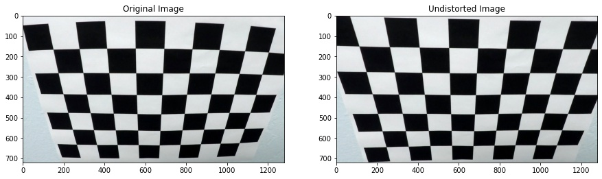
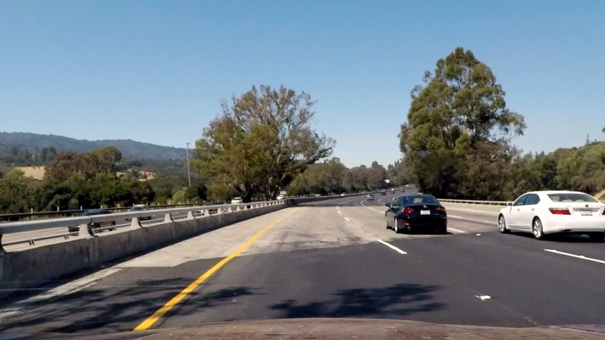
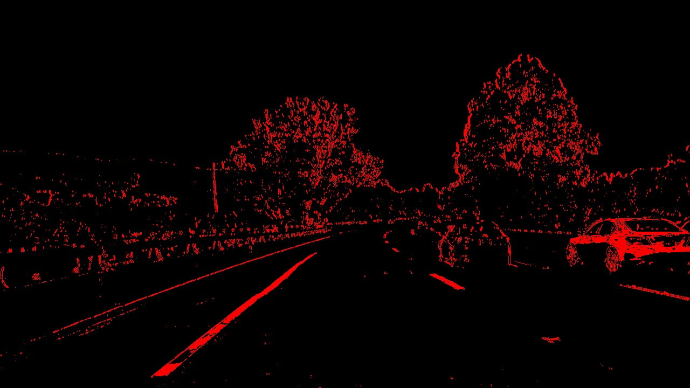
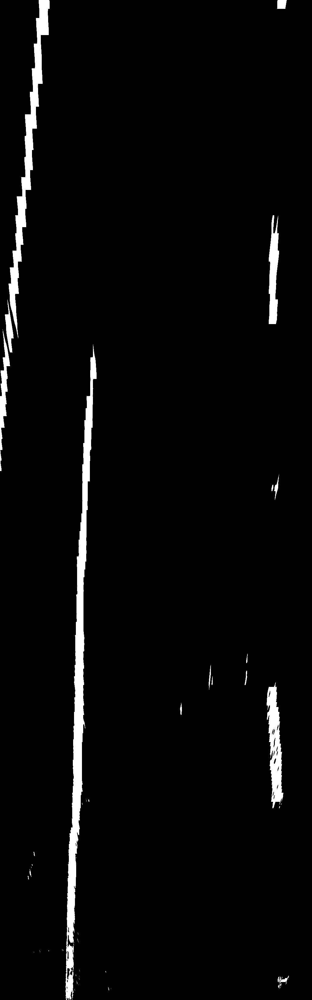
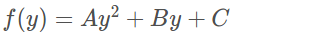
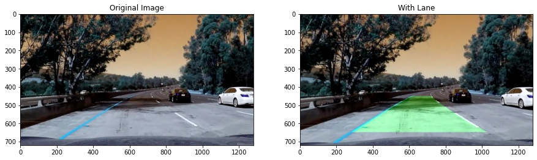

## Advanced Lane Finding
[](http://www.udacity.com/drive)


In this project, goal is to write a software pipeline to identify the lane boundaries in a video. 

The goals / steps of this project are the following:

* Compute the camera calibration matrix and distortion coefficients given a set of chessboard images.
* Apply a distortion correction to raw images.
* Use color transforms, gradients, etc., to create a thresholded binary image.
* Apply a perspective transform to rectify binary image ("birds-eye view").
* Detect lane pixels and fit to find the lane boundary.
* Determine the curvature of the lane and vehicle position with respect to center.
* Warp the detected lane boundaries back onto the original image.
* Output visual display of the lane boundaries and numerical estimation of lane curvature and vehicle position.

### Folder Structure

    .
    ├── camera_cal                     # images for camera calibration
    ├── examples                       # example images to use in writeup
    ├── output_images                  # output images are stored here
    │   ├── binary                     # store binary images
    │   ├── perspective                # store perspective images
    │   └── undistorted                # store undistorted images
    ├── test_images                    # images for testing the pipeline on single frames
    ├── Advanced Lane Finding.ipynb    # Main script
    ├── calibrate_cam.py               # script to calibrate the camera
    ├── get_perspective.py             # script that transforms image into perspective
    ├── Line.py                        # script that identifies and draws lanes
    ├── LICENSE
    └── README.md 

## Step-by-step procedure

### Camera Calibration

I start by preparing "object points", which will be the (x, y, z) coordinates of the chessboard corners in the world. Here I am assuming the chessboard is fixed on the (x, y) plane at z=0, such that the object points are the same for each calibration image.  Thus, `objp` is just a replicated array of coordinates, and `objpoints` will be appended with a copy of it every time I successfully detect all chessboard corners in a test image.  `imgpoints` will be appended with the (x, y) pixel position of each of the corners in the image plane with each successful chessboard detection.  

I then used the output `objpoints` and `imgpoints` to compute the camera calibration and distortion coefficients using the `cv2.calibrateCamera()` function.  I applied this distortion correction to the test image using the `cv2.undistort()` function and obtained this result: 



### Creating thresholded binary image

Below is an image that went through the distortion correction:


In the pipeline, I used a gradient in the x direction, and filtered with threshold. Additionally, I used the union of lightness of CIELAB space and saturation of HLS space to make the lines more visible and stacked with gradient. Here's an example of my output for this step. 



### Perspective transform

The code for my perspective transform is in get_perspective.py with get_perspective function that takes as inputs an image (`img`) and returns transformation matrix, inverse transformation matrix, and transformed image. Function transforms the image with real aspect ratio using the similar logic of those mobile camera scanners.

This resulted in the following source and destination points:

| Source        | Destination   | 
|:-------------:|:-------------:| 
| 544, 450      | 0, 0          | 
| 736, 450      | 1024, 0       |
| 128, 648      | 0, 3280       |
| 1152, 648     | 1024, 3280    |

Resulting image is displayed below:



### Lane Detection
After that the lane line detection is performed on transformed image. First histogram is computed on the image, then we use sliding window where in each window lines are detected and used as a starting point for the next window.

After detecting all the left and right lane pixels, we find a fit using np.polyfit as follows:

```
### Fit a second order polynomial to each using `np.polyfit` ###
    left_fit = np.polyfit(lefty, leftx, 2)
    right_fit = np.polyfit(righty, rightx, 2)
```

#### Radius of curvature of the lane
In the `compute_lane_curvature` function we compute the lane curvature radius using the following formula:




where f(y) is the fitted curve.

#### Lane drawing

After lanes are detected, to visualize the detected lane we draw the lane in `search_around_poly` function.  Here is an example of my result on a test image:



---

### Pipeline (video)

Here's a [link to my video result](./project_video_out.mp4)

---

### Discussion

My implementation worked fairly well for the first video. However, it failed the challenges. In order to pass the challenges, I need to create a more robust thresholded binary image where lanes are visible in a more clear matter.
